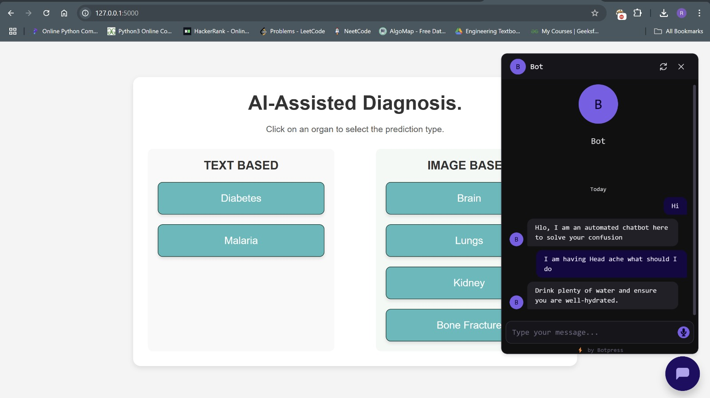

# 🧠 AI-Assisted Early Disease Detection Platform 🧠

A multi-disease **AI-based medical screening system** capable of detecting early signs of several critical health conditions through medical images and clinical data. This platform integrates multiple trained ML/DL models into a unified web interface powered by Flask.

The main entry point is `app.py`, which handles:

- Brain disease (stroke + tumour) detection via image upload
- Kidney stone detection via image upload
- Lung cancer detection via image upload
- Bone/hand fracture detection via image upload
- Diabetes prediction via questionnaire-based flow
- Redirect to a separate **Malaria detection Flask service** running on a different port (`127.0.0.1:5001`)
---
## 📦 Download Full Project

The complete project, including report, trained models, templates, and Flask code, can be downloaded here:

👉 **Google Drive Download:**  
**https://drive.google.com/file/d/1vLN8f3wzhw9NMYWoBeOsmzo6CWxhsNSK/view?usp=drive_link**

---
## 🚀 Features

- **Brain Disease Detection** (Brain Tumor + Brain Stroke)
- **Kidney Stone Detection**
- **Lung Cancer Detection**
- **Bone/Hand Fracture Detection**
- **Diabetes Prediction (Questionnaire-based ML Model)**
- **Malaria Prediction (Dedicated Flask Service on another port)**
- Real-time predictions from uploaded medical images
- Modular architecture using separate detector classes for each disease
- Intuitive web interface
- Completely free to download (full project link below)

---


## 🛠️ Installation & Running Guide

### 1️⃣ Set Up the Project

```bash
# Download the project
cd AI-Assisted-Disease-Detection

# Install all required dependencies
pip install -r requirements.txt
```

### 2️ Start All Disease-Specific Flask Services

- Each detection module runs independently and must be started before running the main app.py.
- Run each of the following in separate terminals:

### Run each .py file in separate terminals

```bash
python BrainTumorDetection.py
python BrainStrokeDetection.py
python KidneyStoneDetection.py
python LungCancerDetection.py
python BoneFractureDetector.py
python malaria_app.py
```

⚠️ **Important Notes**: All services must remain running in their terminals. The main app depends on these services to process predictions. Closing any service will disable its corresponding detection feature.

3️⃣ Run the Main Application (app.py)
Once all other Flask services are running:

```bash
python app.py
```
---

# Interface Preview

### Home Page


### Chat Bot



### Login Page


---

## ❤️ Credits

This project was developed collaboratively with the following team members:

**Contributors:**
- **Rahul D V** — [GitHub](https://github.com/rahul5r)
- **M S Nischith Gowda** — [GitHub](https://github.com/msnischith)
- **Dhanush M** — [GitHub](https://github.com/dhanush8m)
